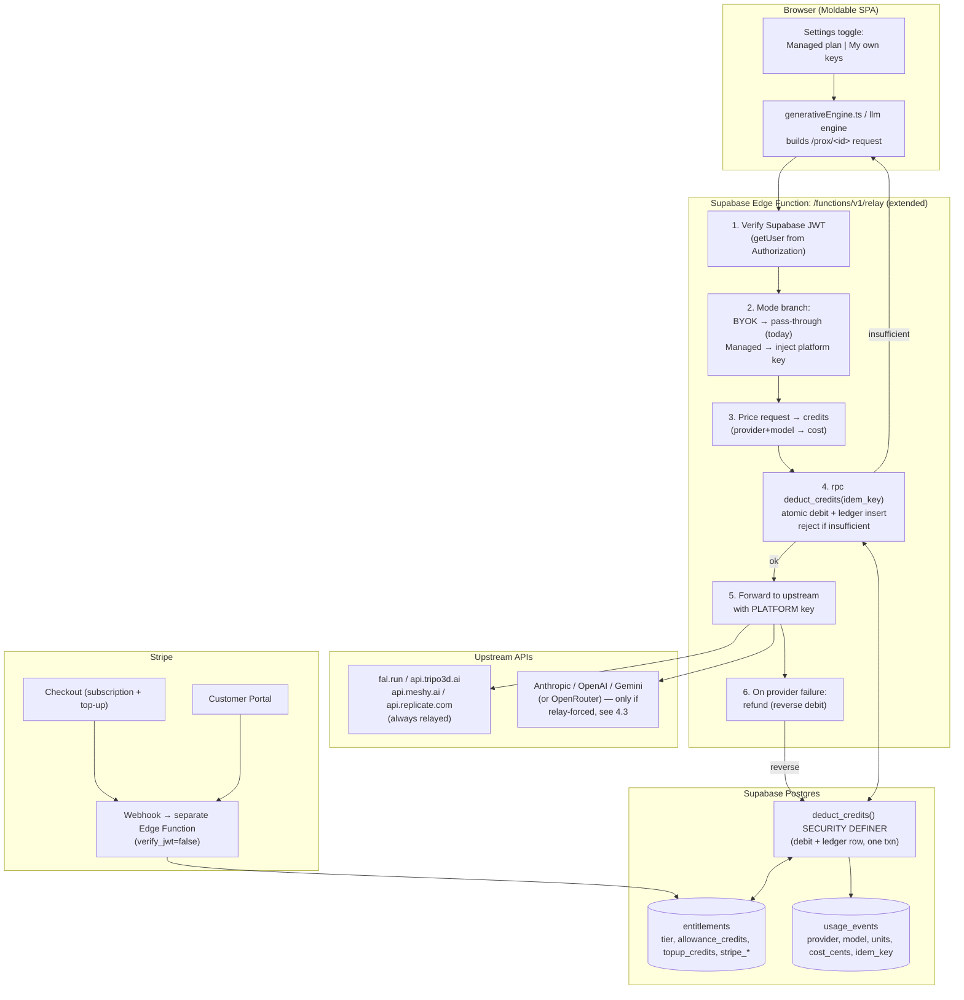

# Moldable: BYOK → Managed-Keys + Credits Build Plan

*Engineering + business plan for adding a managed-keys subscription with credits while keeping BYOK as a first-class option. All code claims are grounded in the current repo (`moldable-lite/`). All prices are **PROPOSED / owner-to-decide**. All external figures are **as-of July 2026 — re-verify** before hard-coding.*

---

## 1. TL;DR

Moldable is 100% bring-your-own-key today: the browser holds the user's Tripo/Meshy/fal/Anthropic keys and the hosted relay (`DEFAULT_RELAY`, a Supabase Edge Function) only solves CORS — it never injects a platform key or meters anything (`cloud.ts:17`, `proxy/cloudflare-worker.js:4-5`, `generativeEngine.ts:22-24`). The shift is to add a **managed tier**: extend that same relay to verify the Supabase JWT, inject *platform* provider keys server-side, and decrement per-user **credits** (backed by new `entitlements` + `usage_events` tables and a Stripe subscription) *before* forwarding the request. **BYOK stays as a tier** — a "Use my own keys" mode that bypasses metering entirely and remains the unlimited/zero-COGS path for power users.

> **Scope note up front:** metering is only trustworthy for traffic that actually traverses the relay. Today that is **3D only** (fal/Tripo/Meshy/Replicate are `viaProxy: true` and always relayed). Managed **LLM** metering is *not* wired up as drawn — LLMs use the relay only as a CORS fallback and Anthropic bypasses it entirely — so it requires a client change before it can be billed (see §4.3). Plan the first managed launch as **managed 3D + BYOK LLM**.

---

## 2. Where Moldable Is Today — You Already Have ~60% of the Plumbing

You are not starting from zero. The auth, the sync store, the encrypted-settings pipeline, and a working provider proxy already exist and already run in production. What's missing is the metering layer *between* auth and the providers.

| Capability | Status | Grounding |
|---|---|---|
| **Cloud auth** (email+pw, GitHub/Google OAuth, magic link, PKCE) | ✅ Done | `cloud.ts:48-89`, `createClient(SUPA_URL, SUPA_KEY, { auth: { flowType: "pkce" }})` `cloud.ts:25` |
| **Per-user server table + RLS pattern** | ✅ Done (`sync_blobs`) | `cloud.ts:96-110`; upsert `{user_id, kind, payload, updated_at}`; select relies entirely on RLS (`cloud.ts:107`, no `user_id` filter) |
| **A live relay/proxy the client already routes paid providers through** | ✅ Done (CORS only) | `DEFAULT_RELAY = ${SUPA_URL}/functions/v1/relay` `cloud.ts:17`; reference impls `proxy/cloudflare-worker.js`, `vite.config.ts` relayPlugin |
| **Client relay selection + availability gate** | ✅ Done | `effectiveProxy = proxyBase || (DEV ? "" : DEFAULT_RELAY)` `App.tsx:133`; `relayAvailable()` `util.ts:13`, enforced `generativeEngine.ts:27` |
| **Settings UI with segmented tabs + real class system** | ✅ Done | `SettingsModal` `App.tsx:1451`; `.seg`/`.card`/`.ghost`/`.primary`/`.sect-label`/`.pill` in `styles.css` |
| **Encrypted settings/projects sync** | ✅ Done | AES-GCM-256, PBKDF2(uid) `backup.ts:17-45`; pushed at `cloud.ts:132-134` |
| **Server-side platform key injection** | ❌ Missing | relay forwards the *user's* key verbatim (`cloudflare-worker.js:58-67`); every provider sends `input.apiKey` (`registry.ts` + `providers/*.ts`) |
| **Per-request metering / credit check** | ❌ Missing | flagged as future work: `proxy/README.md:29`, `docs/COMMERCIALIZATION.md:74,119` |
| **Entitlements / usage / billing tables** | ❌ Missing | only `sync_blobs` exists (`cloud.ts`) |
| **LLM traffic through the relay** | ⚠️ Fallback only | LLMs call the provider **directly first** (`openaiCompat.ts:181-183`); Anthropic has **no** relay route (`anthropic.ts:6,52`) → LLM cannot be metered without a client change (§4.3) |
| **Stripe** | ❌ Missing | no billing code anywhere |

**The gap is narrow and well-defined:** the 3D request already flows `client → relay → provider`. You are inserting *auth-verify + key-inject + meter* into a proxy hop that already exists, and adding two Postgres tables next to a table pattern you already ship. (The LLM path is the one place where the hop does *not* yet exist by default — §4.3.)

> ⚠️ **Reality-check on the premise.** The task assumes the hosted site can "call paid providers without the user's own key." It **cannot today** — the generative engine hard-requires a user key (`generativeEngine.ts:22-24`) and the relay stores/injects nothing (`cloudflare-worker.js:4-5`). That keyless+metered path is exactly what Component 1 builds.

> ⚠️ **Doc/code drift.** `README.md`, `proxy/*.md`, and `docs/COMMERCIALIZATION.md:74` call the Cloudflare Worker "the relay," but the live default is the **Supabase Edge Function** (`cloud.ts:17`). The Worker (`proxy/cloudflare-worker.js`) and Vite relay (`vite.config.ts`) are in-repo *mirrors* of its `/prox/<provider>` + `/prox/dl` contract. **The Edge Function source is not in this repo** — confirm the deployed version in the Supabase dashboard (project `prtpakaxzdmrehpndimy`) before editing.

---

## 3. Target Architecture



### Request lifecycle (managed mode)

1. **Client** builds the same `${proxyBase}/prox/<id>` request it builds today (`fal.ts:6`, `meshy.ts:5`, `tripo.ts:19`, `replicate.ts:6`), but with **no user API key** and the **Supabase session JWT** in `Authorization` instead.
2. **Relay verifies the JWT** (`supabase.auth.getUser(token)`), resolving `user_id`. No valid session → `401`.
3. **Mode branch.** If the request is BYOK (client still sent a provider key), forward verbatim — the current behavior, unchanged. If managed, continue.
4. **Price the request** from `(provider, model)` using a server-side cost table (Component 4).
5. **`deduct_credits(user_id, units, idem_key, …)`** runs as a single atomic RPC (Component 2). It debits the balance **and writes the `usage_events` debit row in the same transaction**, idempotent on `idem_key`. Insufficient → `402`, no upstream call, no charge.
6. **Inject the platform key** for that provider (from an Edge Function secret) and forward to upstream (`UPSTREAM` table, `cloudflare-worker.js:13-24`).
7. **On provider failure, issue an idempotent refund** (reverse the debit — mirror Tripo/fal auto-refunds). The debit's ledger row was already written atomically in step 5, so there is **no** separate post-forward "log usage" insert.

BYOK requests skip the metering steps (pricing, debit, key injection) entirely — they are the current CORS pass-through, so today's users are never blocked and the managed path is purely additive.

---

## 4. Component 1 — Gateway/Relay Changes

**Goal:** turn the CORS pass-through into an *auth-gated, key-injecting, metered* gateway — **without breaking BYOK**.

### 4.1 What exists to extend
- The live default is the Supabase Edge Function at `cloud.ts:17`. Its behavior is mirrored by `proxy/cloudflare-worker.js` (72 lines) and `vite.config.ts` relayPlugin. All three: match `/prox/<provider>/...`, look up `UPSTREAM[provider]` (`cloudflare-worker.js:13-24`), strip `host/origin/referer` (`cloudflare-worker.js:59-61`), forward the body, re-attach CORS. `/prox/dl?url=` passes result files through (`cloudflare-worker.js:46-51`).
- **None inject keys.** `"The user's key rides in the Authorization header from the browser and is forwarded as-is — it is NOT stored here."` (`cloudflare-worker.js:4-5`).

### 4.2 Concrete steps (in the Edge Function)

1. **Add JWT verification.** The client will pass the Supabase access token as `Authorization: Bearer <jwt>` on managed requests. In the function, create a service-role client and call `auth.getUser(jwt)` to resolve `user_id`. Reject `401` if absent/expired. (This is why managed mode must *not* forward the `Authorization` header upstream — see step 4.)

2. **Distinguish managed vs BYOK per request.** Simplest: a header the client sets, e.g. `x-moldable-mode: managed`. In managed mode the client sends **no** provider key and **does** send the Supabase JWT. In BYOK mode the client behaves exactly as today (provider key in `Authorization`, no metering). Default to BYOK when the header is absent so existing traffic is untouched.

3. **Price the request.** Parse `<provider>` from the path (`registry.ts` ids: `fal`, `tripo`, `meshy`, `replicate`) and the model from the body. Map to credits via the server cost table (Component 4). Keep the table **server-side only** — never trust a client-sent price.

4. **Credit check + key injection (order matters).**
   - Call `deduct_credits(user_id, units, idem_key, kind, provider, model, cost_cents)` via RPC (Component 2). This performs the debit **and inserts the matching `usage_events` ledger row inside one transaction**, so the debit and its ledger record commit or roll back together and a retry with the same `idem_key` cannot double-debit. On `insufficient_credits`, return **`402`** with a machine-readable body and **do not** call upstream.
   - On success, **replace** the request's auth with the platform key for that provider — read from an Edge Function **secret** (`FAL_KEY`, `TRIPO_KEY`, `MESHY_KEY`, `REPLICATE_KEY`), formatted per provider (Bearer for tripo/meshy/replicate; `Key <k>` for fal — cf. `fal.ts:7`, `tripo.ts:20`). Delete the inbound Supabase JWT before forwarding so it never leaks upstream.

5. **Handle async provider flows.** Tripo and fal are multi-step (upload → task → poll; fal queue host `queue.fal.run`, `cloudflare-worker.js:18`). **Meter once per generation, not per poll.** Recommended: charge on the *submit* call (the POST that creates the task) and pass a stable `idem_key` for that submit; treat poll GETs as free relayed calls. Refund on provider failure (both Tripo and fal auto-refund their own credits on failed gens — mirror that with a `deduct_credits` reversal / `kind='refund'` event, idempotent on the original `idem_key`).

6. **Do NOT do a separate post-forward "log usage" insert.** The `usage_events` debit row is written **atomically inside `deduct_credits` (step 4)** — inserting it as a separate service-role call *after* the RPC is exactly the pattern that reintroduces the double-debit window (the decrement would commit before the ledger row, so a retry decrements again before the unique index can reject it). If you want to record realized COGS after the response, **UPDATE the existing ledger row by `(user_id, idem_key)`** (service role) rather than inserting a new one.

7. **Keep `/prox/dl` unmetered.** Result-file download (`util.ts:18-33` falls back to `${proxyBase}/prox/dl?url=`) is bandwidth, not generation — leave it a pass-through.

### 4.3 LLM breadth & the managed-LLM path (Rollout Phase 4)

**Architectural caveat — managed LLM is *not* metered by the relay as things stand today.** Unlike the 3D providers (all `viaProxy: true`, so every 3D call is *always* relayed — `registry.ts:47,71,85,96`), LLM providers use the relay only as a **CORS/error fallback**: `openaiCompat.ts` calls the provider **directly first** and only retries through `/prox/<relayPrefix>` when the direct call fails (`openaiCompat.ts:181-183`). Worse, **Anthropic has no `relayPrefix` at all** — `anthropic.ts` always hits `https://api.anthropic.com/v1/messages` directly with the `anthropic-dangerous-direct-browser-access` header (`anthropic.ts:6,52`). So a managed LLM request would go **straight to the provider, never traverse the relay, and never hit `deduct_credits`** — the metering-precedes-key invariant (Section 9) simply does not hold for LLMs by default, and *cannot* hold for native Claude without new code.

**To make managed LLM meterable you must first ship a client change:**
1. In managed mode, **force all LLM traffic through the relay** — disable the direct-first attempt in `openaiCompat.ts` so managed requests go to `/prox/<relayPrefix>` **unconditionally** (never direct).
2. **Add a relay route + platform-key injection for Anthropic**, which today has *no* `relayPrefix`: add one (e.g. `/prox/anthropic`), route `anthropic.ts` through it in managed mode, inject `ANTHROPIC_KEY` server-side, and drop the `anthropic-dangerous-direct-browser-access` header.

**Until that client change ships, managed LLM cannot be metered — only managed 3D works** (fal/tripo/meshy/replicate are `viaProxy: true` and always relayed, so they debit correctly today). Two options for the managed-LLM buildout:

- **Proxy each provider directly** (inject `ANTHROPIC_KEY`, `OPENAI_KEY`, … in the relay) — most control, but requires the forced-relay change above for every provider (and the new Anthropic route).
- **Front all non-Anthropic LLMs with OpenRouter** — one OpenAI-compatible endpoint (`https://openrouter.ai/api/v1`), ~300-400+ models, **0% inference markup** (revenue is a credit-purchase fee), per-user metering via Management/provisioning keys (*approximate, verify*). This collapses N LLM integrations into one **but only sidesteps the routing problem for non-Anthropic models** — native Claude still needs its own relay route + forced-relay change (step 2 above). **OpenRouter has no 3D generation** — 3D must still hit fal/Tripo/Meshy/Replicate directly, so OpenRouter is an LLM-only convenience, not a full gateway.

### 4.4 Client-side change (small)
The client already picks the relay URL at `App.tsx:133` and threads `proxyBase` into every provider. Managed mode needs: (a) send the Supabase JWT + `x-moldable-mode: managed` header instead of a provider key, (b) relax the hard key requirement at `generativeEngine.ts:22-24` when the user is in managed mode (so it doesn't throw `"Add your <provider> API key"`), and (c) **for managed LLM only** — the forced-relay changes from §4.3 (disable direct-first in `openaiCompat.ts`; add the Anthropic relay route in `anthropic.ts`). BYOK mode keeps `needsKey` enforcement and the direct-first LLM behavior exactly as-is.

---

## 5. Component 2 — Supabase Schema

Follows the existing `sync_blobs` conventions: `user_id uuid` keyed to `auth.uid()`, RLS scoping every row, `timestamptz` timestamps, and (for singletons) a PK the client can read under RLS without a `user_id` filter — mirroring `cloud.ts:107`. **These billing tables are NOT encrypted** (unlike `sync_blobs`): the server must read balances in cleartext, so they rely on RLS + service-role writes, not the `backup.ts` envelope.

> Confirm the live schema first with `list_tables` / `list_migrations` (MCP) — no DDL exists in the repo; `sync_blobs` itself is inferred from `cloud.ts:96-110`.

**Two balance buckets, on purpose.** The allowance (the monthly "gym membership") and purchased top-up packs are tracked as **separate** columns so a monthly reset never destroys credits the user paid real money for (see 6.4/6.5). Total spendable = `allowance_credits + topup_credits`.

```sql
-- =========================================================
-- entitlements: one row per user (the singleton, like sync_blobs settings)
-- =========================================================
create table if not exists public.entitlements (
  user_id                uuid primary key references auth.users(id) on delete cascade,
  tier                   text not null default 'free'
                           check (tier in ('free','maker','pro','byok')),
  status                 text not null default 'active'
                           check (status in ('active','trialing','past_due','canceled','unpaid')),
  allowance_credits      integer not null default 0 check (allowance_credits >= 0), -- current-cycle allowance; RESET on invoice.paid
  topup_credits          integer not null default 0 check (topup_credits >= 0),     -- purchased packs; NON-expiring, survive renewal
  monthly_allowance      integer not null default 0,   -- value allowance_credits is reset to each cycle
  renews_at              timestamptz,
  stripe_customer_id     text unique,
  stripe_subscription_id text unique,
  updated_at             timestamptz not null default now()
);

-- =========================================================
-- usage_events: append-only ledger (never UPDATE units/DELETE from app code)
-- =========================================================
create table if not exists public.usage_events (
  id          bigint generated always as identity primary key,
  user_id     uuid not null references auth.users(id) on delete cascade,
  ts          timestamptz not null default now(),
  kind        text not null                                   -- 'gen' | 'llm' | 'grant' | 'topup' | 'refund'
                check (kind in ('gen','llm','grant','topup','refund')),
  provider    text,                                           -- 'fal' | 'tripo' | 'meshy' | 'replicate' | 'anthropic' | ...
  model       text,
  units       integer not null,                               -- ALWAYS POSITIVE; `kind` sets direction: gen/llm = debit, grant/topup/refund = credit
  cost_cents  integer,                                        -- our estimated COGS, for margin reconciliation
  idem_key    text,                                           -- request id; dedupe retries (debit + refund)
  stripe_event_id text                                        -- for grant/topup rows from webhooks
);

create index if not exists usage_events_user_ts_idx on public.usage_events (user_id, ts desc);
create unique index if not exists usage_events_idem_idx on public.usage_events (user_id, idem_key)
  where idem_key is not null;

-- =========================================================
-- RLS: user reads own rows; ONLY service role writes
-- =========================================================
alter table public.entitlements enable row level security;   -- SQL-editor tables are NOT auto-RLS'd
alter table public.usage_events  enable row level security;

-- read-your-own (wrap auth.uid() in a subselect so PG caches it as an initPlan)
create policy "ent_read_own" on public.entitlements
  for select to authenticated using ((select auth.uid()) = user_id);

create policy "use_read_own" on public.usage_events
  for select to authenticated using ((select auth.uid()) = user_id);

-- NO insert/update/delete policies for `authenticated` → clients cannot mutate balances.
-- service_role bypasses RLS entirely, so the relay + webhook write freely.
```

> **Sign convention (single source of truth).** `units` is **always positive**; the `kind` column determines whether the event *debits* (`gen`, `llm`) or *credits* (`grant`, `topup`, `refund`) the balance. `deduct_credits` writes positive `units` with `kind='gen'|'llm'`; the webhook grant/topup writers and the refund path write positive `units` with their respective `kind`. Reconciliation is then `Σ(credit units) − Σ(debit units)` compared against the balance delta — and it nets out because every writer agrees on this one rule.

### Free-tier provisioning (no-checkout users)
RLS makes clients **read-only**, and only the Stripe webhook (service role) writes `entitlements`. So a user who **never checks out** would have **no `entitlements` row at all** — and then `deduct_credits`' guarded `UPDATE ... WHERE user_id = p_user` would match nothing, hit `if not found`, and raise `insufficient_credits`, making the advertised "~20 free managed credits" **unspendable**. Fix it by provisioning a free row the moment the auth user is created:

```sql
create or replace function public.handle_new_user()
returns trigger
language plpgsql
security definer
set search_path = ''
as $$
begin
  insert into public.entitlements (user_id, tier, status, allowance_credits, monthly_allowance)
    values (new.id, 'free', 'active', 20, 20)      -- ~20 free managed credits
    on conflict (user_id) do nothing;
  return new;
end;
$$;

create trigger on_auth_user_created
  after insert on auth.users
  for each row execute function public.handle_new_user();
```

Belt-and-suspenders: the relay can also **lazy-provision** on first managed request — if `deduct_credits` reports no row, service-role `insert ... on conflict do nothing` a free row and retry once. Document **both** provisioning paths (trigger for signup, lazy-provision fallback in the relay) alongside the webhook-driven paid provisioning, so no user can reach the debit path without a row.

### Atomic credit decrement (race-safe **and** idempotent)
Never `SELECT`-then-`UPDATE` from the client — supabase-js doesn't wrap two calls in one transaction. And **never** insert the ledger row in a *separate* call after the RPC: PostgREST wraps each `rpc()` in its own transaction, so the decrement would commit before the ledger insert ran, and a retry with the same `idem_key` would decrement a **second** time before the unique index could reject it — a real double-debit. Instead, do the check, the write, **and the ledger insert** in one `SECURITY DEFINER` function called over RPC, so a unique-violation on `idem_key` aborts and rolls the decrement back:

```sql
create or replace function public.deduct_credits(
  p_user       uuid,
  p_amount     integer,
  p_idem_key   text,
  p_kind       text    default 'gen',
  p_provider   text    default null,
  p_model      text    default null,
  p_cost_cents integer default null
)
returns integer                 -- returns total spendable (allowance + topup) after the op
language plpgsql
security definer
set search_path = ''            -- required hardening for SECURITY DEFINER
as $$
declare
  v_allow integer;
  v_topup integer;
  v_total integer;
begin
  -- Fast idempotency path: if this idem_key already debited, return the
  -- current total UNCHANGED instead of debiting again.
  if p_idem_key is not null then
    perform 1 from public.usage_events
      where user_id = p_user and idem_key = p_idem_key;
    if found then
      select allowance_credits + topup_credits into v_total
        from public.entitlements where user_id = p_user;
      return coalesce(v_total, 0);
    end if;
  end if;

  -- Single guarded UPDATE: draw from allowance first, then top-ups.
  -- (All column refs in SET use the OLD row values within one UPDATE.)
  update public.entitlements
     set allowance_credits = greatest(allowance_credits - p_amount, 0),
         topup_credits     = topup_credits - greatest(p_amount - allowance_credits, 0),
         updated_at        = now()
   where user_id = p_user
     and allowance_credits + topup_credits >= p_amount     -- the guard
  returning allowance_credits, topup_credits into v_allow, v_topup;

  if not found then
    raise exception 'insufficient_credits' using errcode = 'P0001';
  end if;

  -- Ledger insert in the SAME transaction as the debit. A retry with the
  -- same idem_key hits usage_events_idem_idx and raises unique_violation,
  -- which rolls the decrement above back with this transaction.
  insert into public.usage_events (user_id, kind, provider, model, units, cost_cents, idem_key)
    values (p_user, p_kind, p_provider, p_model, p_amount, p_cost_cents, p_idem_key);

  return v_allow + v_topup;
exception
  when unique_violation then
    -- A concurrent retry raced past the pre-check; its decrement is rolled
    -- back with this txn. Return the PRIOR balance, unchanged.
    select allowance_credits + topup_credits into v_total
      from public.entitlements where user_id = p_user;
    return coalesce(v_total, 0);
end;
$$;

-- only the trusted server path should call this (relay uses service role)
revoke execute on function public.deduct_credits(uuid, integer, text, text, text, text, integer)
  from anon, authenticated;
```

The single guarded `UPDATE` takes a row lock, so concurrent callers serialize and re-check against committed state → **no overspend under Postgres default READ COMMITTED** for this single-row pattern. Because the debit **and** the ledger insert run in the **same function/transaction**, the idempotency is *real* rather than aspirational: the pre-check short-circuits a retry that already landed, and if two retries race, the loser's `usage_events` insert violates `usage_events_idem_idx`, raising `unique_violation`, which rolls the decrement back and returns the prior balance. A retried request therefore can **never** double-debit — the decrement and its ledger row commit or roll back as a unit, never as two independent calls.

*(Grants, top-ups and refunds are written by the trusted server path — webhook or relay — as a service-role `UPDATE` plus a matching `usage_events` row, all with **positive** `units` per the sign convention above. A monthly `grant` sets `allowance_credits = monthly_allowance`; a `topup` does `topup_credits = topup_credits + n`; a `refund` returns `units` to the bucket the debit drew from (allowance first). Grant/topup rows dedupe on `stripe_event_id`; refund rows dedupe on the original request's `idem_key` so a retry storm can't over-credit.)*

---

## 6. Component 3 — Stripe Flow

### 6.1 Catalog (create once)
- **Products/Prices per tier** (recurring, monthly): `price_maker`, `price_pro`. (BYOK tier can be a $0 or low flat price, or handled as a plain flag — see Component 4.)
- **One-time top-up Prices** for credit packs (mode `payment`).
- Optionally define **Features** in Stripe's catalog and let Stripe emit **Entitlements**, *or* derive tier from the subscription's price id in your webhook (simpler, fully in your control — recommended for a two-table design).

### 6.2 Checkout
- **Subscriptions:** `Checkout.Session` with `mode: 'subscription'`, `line_items: [{ price: price_maker }]`, `success_url`, `cancel_url`. Put the Supabase `user_id` in **both** `client_reference_id` and `subscription_data.metadata.userId` so it rides into every webhook.
- **Top-ups:** `mode: 'payment'`, one-time price → credit the ledger on the payment webhook.
- **Critical:** do **not** grant access on the `success_url` redirect (reachable without payment settling, replayable). Show a "provisioning…" state that polls `entitlements`, which the webhook writes.

### 6.3 Customer Portal
Configure once (Dashboard or billing_portal Configuration API): plan switch, payment-method update, invoice history, **cancel at period end** (user keeps access until `renews_at`). Per user: create a `billing_portal.Session { customer, return_url }` and redirect. Portal actions emit the **same webhooks** — no extra handlers. A scheduled cancel arrives as `customer.subscription.updated` with `cancel_at_period_end=true` (not `deleted`). *(Note: usage-based/multi-product subs can be canceled but not plan-switched in the portal — verify against current behavior.)*

### 6.4 Webhook Edge Function (writes entitlements)
Deploy as a **separate** Edge Function with **`verify_jwt = false`** in `supabase/config.toml` (`[functions.stripe-webhook] verify_jwt = false`) — Stripe has no Supabase user token.

- Verify with the **raw body** + `Stripe-Signature` via `await stripe.webhooks.constructEventAsync(body, sig, SIGNING_SECRET, undefined, Stripe.createSubtleCryptoProvider())` (the async + SubtleCrypto variant is required in Deno/edge; sync `constructEvent` won't work). Return `400` on failure.
- Create a **service-role** client (`createClient(SUPABASE_URL, SERVICE_ROLE_KEY)`) and **upsert** `entitlements` keyed on `stripe_subscription_id`.
- **Idempotency:** dedupe on `event.id` (unique index / upsert); Stripe retries and can duplicate. Events are **not ordered** — treat the Subscription object as canonical and re-`retrieve` it in the handler rather than trusting arrival order.

**Events to handle:**

| Event | Action on `entitlements` / ledger |
|---|---|
| `checkout.session.completed` | Read `client_reference_id`/metadata → link `stripe_customer_id` ↔ `user_id`; provision initial state |
| `customer.subscription.created` / `.updated` | **Source of truth:** set `tier` (from price id), `status`, `renews_at` (`current_period_end`), `stripe_subscription_id`, `cancel_at_period_end` |
| `customer.subscription.deleted` | `status='canceled'`; drop to `free` tier / zero managed allowance (`allowance_credits = 0`; leave `topup_credits` alone) |
| `invoice.paid` | Renewal succeeded → extend `renews_at`, **reset the allowance bucket only** (`allowance_credits = monthly_allowance`) and **preserve `topup_credits`** (purchased credits never expire on renewal); write a `kind='grant'` event |
| `invoice.payment_failed` | `status='past_due'`; start dunning; revoke after Stripe retries exhaust |
| `checkout.session.completed` (mode `payment`) or `payment_intent.succeeded` | **Top-up:** `topup_credits += pack_size`; `kind='topup'` event keyed on `stripe_event_id` |

> **Why two buckets (and why the old single-column reset was a bug):** if `invoice.paid` set the whole balance to `monthly_allowance` (an overwrite), every renewal would **destroy any unused top-up credits the user purchased** — a correctness bug and a chargeback/complaint magnet (users lose credits they paid real money for). Resetting only `allowance_credits` and leaving `topup_credits` untouched makes the balance after renewal `monthly_allowance + remaining_topups`, which is what the user is owed.

### 6.5 Monthly allowance vs top-ups
- **Monthly allowance** = the "gym membership": reset **`allowance_credits`** to `monthly_allowance` on `invoice.paid`. This touches **only** the allowance bucket, never `topup_credits`. Simple counter, predictable UX. (Decide: do unused allowance credits roll over? Recommend **no rollover** for the allowance bucket, matching Meshy — the allowance is what resets; top-ups are what persist.)
- **Top-ups** = one-time `mode:'payment'` packs that add to a **separate, non-expiring `topup_credits` bucket**. `deduct_credits` draws down `allowance_credits` first, then `topup_credits`, so a renewal that resets the allowance never destroys purchased credits. Best for overage without forcing a plan upgrade.

*(Stripe's native Billing Credits/Meters are an alternative to the app-managed ledger above. For Moldable's two-table design, the app-managed ledger is simpler and keeps the balance in Postgres where the relay's `deduct_credits` already lives. Note: legacy Usage Records API was removed in `2025-03-31.basil` — if you go native, use Meters. **Verify Stripe API version + object shapes against the live reference.**)*

---

## 7. Component 4 — Credit / Tier Structure Sized to 3D-Gen Costs

### 7.1 Define the credit unit
**1 credit ≈ US$0.01 of platform COGS** (matches Tripo's & Stability's `$0.01/credit` API pricing and GitHub Copilot's "1 credit = $0.01" convention — *approximate, verify*). This is an **upper-bound invariant, not just a slogan**: assign each op enough credits that its researched COGS ≤ `credits × $0.01` (i.e. **COGS-per-credit ≤ $0.01**). Plans are then priced at a markup over the worst-case COGS of their included credits. Store the credit→cents table **server-side in the relay only**. The table in 7.2 is sized to honor the invariant on every exposed op.

### 7.2 Operation → credits map

| Operation | Underlying cost (**approximate, verify**) | **PROPOSED** credits | COGS/credit | Source |
|---|---|---|---|---|
| **Precise CAD build** (deterministic geometry compile) | ~$0 (runs client-side in the CAD engine) | **0** | — | engine is local; only the authoring LLM call costs |
| LLM message — cheap (Haiku 4.5 / GPT-5.1) † | ~$0.01–0.02/part | **1–2** | ≤$0.01 | `registry`/AI-pane hints `App.tsx:1648`, `anthropic.ts` |
| LLM message — mid (Claude Sonnet 5) † | ~$0.03/part | **3** | $0.010 | `App.tsx:1647` |
| LLM message — premium (Claude Fable 5) † | ~$0.10/part | **10** | $0.010 | `App.tsx:1645` |
| Web-search grounding lookup † | ~$0.01 | **1** | $0.010 | `App.tsx:1651` |
| **3D gen — HF free** (Stable Fast 3D / Hunyuan3D-2 / TRELLIS) | $0 to us (shared GPU quota) | **0** (rate-limited, not credited) | — | `registry.ts:9-38`, `hf.ts` |
| **3D gen — Replicate TRELLIS** | ~$0.04/run | **~5** | $0.0080 | `registry.ts:95,101` |
| **3D gen — fal Hunyuan Mini / TripoSR** | ~$0.05–0.10 | **~10** | $0.010 | web:3dgen-pricing |
| **3D gen — Replicate Hunyuan3D-2** | ~$0.11 | **~12** | $0.0092 | `registry.ts:105` (managed-only) |
| **3D gen — fal Hunyuan v2** | ~$0.16 | **~18** | $0.0089 | web:3dgen-pricing |
| **3D gen — Replicate Hunyuan3D-2.1** | ~$0.27 | **~28** | $0.0096 | Replicate registry (managed-only, verify) |
| **3D gen — Tripo image-to-3D** | ~$0.30 | **~32** | $0.0094 | `registry.ts:74`, web:3dgen-pricing |
| **3D gen — fal Hunyuan v3.1 Pro** (base) ‡ | ~$0.375 | **~40** | $0.0094 | `registry.ts:51-52` |
| **3D gen — Meshy 6 / fal Rodin Gen-2** | ~$0.40 | **~42** | $0.0095 | `registry.ts:57,87` |
| **3D gen — Tripo P1 / H3.1 (high-detail)** | ~$0.60–0.80 | **~65–85** | ≤$0.0094 | web:3dgen-pricing |

> † **Metering reality for the LLM rows:** the 3D rows above debit correctly today (those providers are always relayed). The **LLM rows are only meterable once the managed-LLM client change in §4.3 ships** — until then LLM calls bypass the relay (and Anthropic bypasses it entirely), so `deduct_credits` never runs for them. For a first managed launch, meter **3D only** and keep LLM on BYOK.
>
> ‡ **fal Hunyuan v3.1 Pro add-ons.** The base run is ~$0.375, but the researched rate sheet adds **+$0.15 for PBR** and **+$0.15 for multi-view**, pushing true COGS to as much as **$0.675** while still nominally billing 40 credits — that's ~$0.0169/credit, well over the $0.01 invariant. In managed mode either **disable PBR/multi-view**, or **surcharge +~16 credits per add-on** in the server cost table (40 → up to 72 credits fully loaded, which keeps COGS/credit ≤ ~$0.0094). Do not bill the base 40 while silently enabling an add-on.

> Design principle: **CAD is free/cheap, LLM chat is cheap, 3D generation is the expensive unit.** Credits exist mainly to meter 3D gens; LLM chat is a minor draw; free-provider routing (HF, Gemini free tier) costs ~$0 and should stay unmetered so the free tier is genuinely useful. If you expose the Replicate Hunyuan3D-2 / 2.1 models in managed mode, price them at their **own** rows above — do **not** let them fall through to the ~5-credit TRELLIS rate, which would under-charge them by 2–6×.

### 7.3 Tiers (**ALL PROPOSED — owner decides**)

| Tier | **PROPOSED** price/mo | Included credits/mo | Worst-case COGS of allowance | Notes |
|---|---|---|---|---|
| **Free** | $0 | ~20 managed + unlimited **free-provider** routing (HF, Gemini free) | ~$0.20 + shared-GPU load | Enough to try ~1 cheap paid gen; real work runs on free providers. **Row auto-provisioned on signup** by `handle_new_user` (Component 2) — without it the 20 credits are unspendable |
| **Maker** | **~$12** | **~400** | ~$4.00 (400 × $0.01 ceiling op) | ~10 premium gens *or* ~50 cheap gens + lots of CAD/LLM |
| **Pro** | **~$29** | **~1,200** | ~$12.00 (1,200 × $0.01 ceiling op) | ~30 premium gens; power hobbyist / small shop |
| **BYOK-unlimited** | **~$9** flat (or keep free) | n/a (user's own keys) | **~$0 variable** | Unlimited gens billed to the user's provider accounts; you carry ~zero COGS |

### 7.4 Margin math (illustrative, **PROPOSED**)
Worst-case COGS of an allowance = included credits × the **highest COGS-per-credit among the ops actually exposed in managed mode** (not a flat credits×$0.01 assumption). The 7.2 table is re-priced so every exposed op sits at **≤ $0.01 COGS/credit** — the ceiling op is **fal Hunyuan Mini at $0.10 / 10 credits = $0.010/credit** (the Pro/Rodin tier is $0.375 / 40 ≈ $0.0094). So the worst case bottoms out at the $0.01/credit ceiling:

- **Maker $12:** worst-case COGS = 400 × $0.010 = **$4.00** + Stripe (~2.9% + $0.30 ≈ $0.65) → **~$7.35 gross (≈61%)**. Realized margin is higher — typical users don't burn 100% on the ceiling op.
- **Pro $29:** worst-case COGS = 1,200 × $0.010 = **$12.00** + ~$1.14 Stripe → **~$15.86 gross (≈55%)**.
- **BYOK $9:** COGS ~$0 → **~$8.35 gross (≈93%)** — this tier subsidizes the heavy users you'd otherwise lose money on.

> **The $12/$4 bound holds *only* because every exposed op is re-priced to ≤ $0.01/credit.** If any op is left above that — e.g. the **un-repriced** Hunyuan Mini at 8 credits = $0.0125/credit (which would make the true Pro worst-case ~$15 = 1,200 × $0.0125), or Hunyuan v3.1 Pro with PBR/multi-view add-ons un-surcharged at ~$0.0169/credit — the Pro worst-case climbs to **~$15–20** and the stated margins are optimistic. Enforce the ≤ $0.01/credit ceiling in the server cost table; that invariant *is* the margin guarantee. (Still profitable even in the un-repriced case, since credits are sold at ~$0.018–$0.03 each — but not internally consistent, which is why the table is re-priced.)

### 7.5 Overage + BYOK-unlimited
- **Overage:** when the balance (`allowance_credits + topup_credits`) hits 0, offer **top-up packs** (e.g. **PROPOSED** 500 credits for ~$9 via `mode:'payment'`, added to the non-expiring `topup_credits` bucket) *or* graceful degradation to **free-provider routing** (HF/Gemini) for the rest of the cycle — the Cursor "fall back to Auto" pattern, which reduces churn vs a hard block.
- **BYOK-unlimited** is the pressure valve: power users bring their own fal/Tripo/Anthropic keys (the current mechanism, unchanged), so their heavy usage never touches your COGS. Gate clearly which features BYOK covers.

---

## 8. Component 5 — "Your Plan vs. Your Own Key" Settings Toggle

Net-new — no plan/managed/credits concept exists today (the codebase is 100% BYOK; `DEFAULT_RELAY` is a CORS proxy, not a key). Insert a `.seg` segmented control in the **AI pane** (`App.tsx:1625-1689`), right **after** the "Which one should I pick?" `<details>` (`App.tsx:1642-1652`) and **before** the `lp === "anthropic" ?` branch (`App.tsx:1653`). The same pattern is repeated in the mesh pane. Persist the mode under a `moldable_*` key (e.g. `moldable_keymode`) so `backup.ts` `gatherSettings()` and cloud sync pick it up automatically.

```jsx
{/* ── Key mode: managed plan vs BYOK ── ordered before the lp==="anthropic" branch ── */}
<div className="sect-label">How you pay for AI</div>

<div className="seg">
  <button
    className={keyMode === "managed" ? "on" : ""}
    onClick={() => setKeyMode("managed")}
  >
    Use my Moldable plan
  </button>
  <button
    className={keyMode === "byok" ? "on" : ""}
    onClick={() => setKeyMode("byok")}
  >
    Use my own keys
  </button>
</div>

{keyMode === "managed" ? (
  <div className="card" style={{ marginTop: 12 }}>
    {signedIn ? (
      <>
        <p className="pane-desc">
          Runs on Moldable&apos;s keys — no setup. Each 3D generation spends credits;
          precise CAD edits are free.
        </p>
        <div className="param-actions">
          <span className="pill">{creditsRemaining} credits left</span>
          <span className="fine">{tierLabel} · renews {renewsAt}</span>
        </div>
        <button className="primary block" onClick={onUpgrade}>
          {tier === "pro" ? "Buy more credits" : "Upgrade plan"}
        </button>
      </>
    ) : (
      <>
        <p className="pane-desc">Sign in to use your Moldable plan.</p>
        <button className="primary block" onClick={() => setPane("sync")}>
          Sign in
        </button>
      </>
    )}
  </div>
) : (
  <>
    {/* existing BYOK fields — the current App.tsx:1653-1687 block, unchanged */}
    {lp === "anthropic" ? (
      <>
        <label>Anthropic API key</label>
        <input type="password" value={k} onChange={(e) => setK(e.target.value)} placeholder="sk-ant-…" />
        <label>Claude model</label>
        <select value={m} onChange={(e) => setM(e.target.value)}>
          {MODELS.map((x) => (
            <option key={x.id} value={x.id}>{x.label}{x.recommended ? " · recommended" : ""}</option>
          ))}
        </select>
      </>
    ) : (
      /* …existing non-anthropic key / baseUrl / model-id inputs… */
      null
    )}
  </>
)}
```

`creditsRemaining` shown in the pill is **client-derived** = `allowance_credits + topup_credits`, read from the user's own `entitlements` row under RLS (read-only). Classes used are the app's real ones: `.card` (`styles.css:97`), `.sect-label` (`:106`), `.seg`/`.seg button.on` (`:258-260`), `.pane-desc` (`:371`), `.fine` (`:109`), `.param-actions` (`:432`), `.primary.block` (`:233`), `.ghost` (`:130`), `.pill`. Wire the new mode through `saveAll()` (`App.tsx:1594-1607`) so it persists like the other settings; in managed mode, the save path skips writing `KEY_LS`/`LLMKEYS_LS` and instead relies on the session JWT.

---

## 9. Security & Abuse

- **Metering MUST precede opening platform keys.** The instant the relay injects a platform key without a *prior, atomic* credit check, a single scripted client can drain your provider balance at $0.375/gen. `deduct_credits()` returning `402` *before* the upstream call (Component 1 step 4) is the hard gate — never inject a key on a request that hasn't already debited. This is *the* invariant. **Corollary (see §4.3):** it only holds for traffic that reaches the relay — 3D always does; managed LLM does **not** until the forced-relay client change ships, so do not open platform LLM keys before that exists.
- **The debit must be idempotent *in the same transaction* as the ledger row.** A retried request with the same `idem_key` must not double-debit. This is guaranteed only because `deduct_credits` writes the `usage_events` row inside the same transaction as the decrement (Component 2) — a post-hoc insert in a separate call does **not** provide this and reintroduces the double-debit window.
- **Hard caps, not just credits.** Per-user rate limits (gens/min, gens/day) independent of balance, so a compromised/abusive account can't burn a full allowance in seconds or hammer providers. Cap concurrent in-flight gens per user.
- **Free-tier fraud.** Free credits attract multi-account farming. Mitigate: require email confirmation (already supported, `cloud.ts:82`), route the free tier to **zero-COGS** providers (HF/Gemini free) so a fake account costs ~$0, keep free *managed* credits tiny (~20, provisioned by `handle_new_user`), and consider device/IP heuristics before granting paid-provider credits.
- **Key custody.** Platform provider keys live **only** as Edge Function secrets, never in the client (the client holds only the publishable Supabase key, `cloud.ts:16`). Rotate on leak. The Supabase service-role key stays server-side in the relay + webhook functions exclusively.
- **Trust boundary.** The publishable key + project URL ship to the browser by design; therefore every entitlement decision runs under RLS or service-role Edge Functions — **never** trust a client-sent price, mode, or credit count. RLS gives users read-only visibility of their own `entitlements`/`usage_events`; only the service role writes.
- **Webhook integrity.** Verify Stripe signatures on the raw body; idempotent handlers keyed on `event.id`; `verify_jwt=false` only on the webhook function.
- **Refund correctness.** Provider failure must reverse the debit (mirror Tripo/fal auto-refunds), and the reversal itself must be idempotent (keyed on the request `idem_key`) so a retry storm can't over-credit. Refund rows follow the sign convention (positive `units`, `kind='refund'`).

---

## 10. Rollout Phases

| Phase | Scope | Risk / notes |
|---|---|---|
| **0 — Keep BYOK** | Ship nothing; today's app is the baseline. BYOK stays the default and never breaks. | Zero risk; establishes the "always an escape hatch" guarantee. |
| **1 — Tables + Stripe + entitlements** | Add `entitlements` (two buckets), `usage_events`, `deduct_credits()` (debit+ledger in one txn), `handle_new_user` free-tier trigger, RLS. Stand up Checkout + Portal + webhook Edge Function. Users can subscribe; balances populate; free users get a row on signup. **No relay gating yet.** | Billing is live but inert — safe to test end-to-end (test-mode Stripe) without touching generation. Verify free-tier provisioning + top-up/allowance separation. |
| **2 — Gate relay + meter 3D** | Extend the Edge Function: JWT verify, managed/BYOK branch, price, `deduct_credits`, inject platform keys, refund-on-failure. Add the Settings toggle (Component 5), defaulting to BYOK. **3D only** — LLM stays BYOK. | The one behavior-changing phase. Roll out behind the toggle; BYOK path is untouched. Load-test the atomic decrement and the idempotent-retry path. |
| **3 — Flip BYOK to optional** | Make **managed** the default mode for new/signed-in users; BYOK becomes an explicit choice (toggle stays). Relax `generativeEngine.ts:22-24` key requirement in managed mode. | Communicate clearly; existing BYOK users keep their keys and workflow. |
| **4 — Managed LLM (relay-forced) + OpenRouter breadth** | Ship the client change §4.3 **requires**: force all LLM traffic through the relay in managed mode (disable direct-first in `openaiCompat.ts`) and add an Anthropic relay route + `ANTHROPIC_KEY` injection (Anthropic has **no** `relayPrefix` today). Then optionally front non-Anthropic LLMs via OpenRouter. 3D stays direct to fal/Tripo/Meshy/Replicate. | **Prerequisite, not a nicety, for metering LLMs**: without the forced-relay change managed LLM cannot be debited at all (native Claude least of all). Adds a proxy in the LLM path (data-governance consideration); re-verify OpenRouter fees/limits. |

---

## 11. Open Decisions for the Owner

- **Tier prices** — Maker (~$12?), Pro (~$29?), BYOK flat fee (~$9? or keep free?). All PROPOSED.
- **Credit sizes per tier** — 20 / 400 / 1,200? And the credit→cents table exact values (must keep every exposed op ≤ $0.01/credit COGS).
- **Credit unit definition** — stick with 1 credit ≈ $0.01 COGS (as an enforced ceiling), or a rounder "1 gen = N credits" scheme?
- **Rollover** — do unused **allowance** credits roll over, or reset each cycle (recommended: reset the allowance bucket; top-ups always persist)?
- **Top-up vs allowance policy** — confirm top-ups are a separate non-expiring bucket drawn down after allowance (recommended — avoids destroying paid credits on renewal).
- **Overage behavior** — top-up packs vs graceful degradation to free providers vs hard block?
- **Managed LLM** — ship the forced-relay + Anthropic-route change to meter LLM at all, or keep LLM permanently BYOK and only meter managed 3D?
- **Gateway choice** — keep extending the Supabase Edge Function (recommended: it's the live default) vs move to the Cloudflare Worker vs a dedicated gateway (LiteLLM/Portkey)?
- **OpenRouter or not** for managed LLMs (breadth + simplicity vs an extra proxy + fees in the path, and it still doesn't cover native Claude)?
- **Which 3D providers/models to expose in managed mode** (all, or a curated cheap/premium set — and price the Replicate Hunyuan3D-2/2.1 rows explicitly if exposed, to control COGS)?
- **Free-tier generosity** vs fraud exposure — how many free managed credits, and gated behind email confirmation / device checks?
- **Stripe native Billing Credits/Meters vs app-managed ledger** (recommended: app-managed, to keep balance next to `deduct_credits`).

---

## 12. Caveats

- **All prices are PROPOSED / owner-to-decide** — nothing here is a committed price.
- **All external figures are as-of July 2026 and must be re-verified.** 3D-gen pricing (fal, Tripo, Meshy, Replicate, Stability) was gathered from search snippets because vendor pages returned 403 to direct fetch; treat every `$/gen` as *approximate, verify* against the live rate sheet before hard-coding credit costs — **including add-ons** (fal Hunyuan v3.1 Pro PBR/multi-view at +$0.15 each). 3D model versions and prices ship every few months.
- **Metering only covers relayed traffic.** As shipped, that is 3D (`viaProxy: true`). Managed LLM requires the §4.3 client change (forced relay + Anthropic route) before it can be billed; do not assume the drawn LLM metering works out of the box.
- **Stripe specifics need verification against the live API reference** (doc pages 403'd during research): Meter/Credit object shapes, Entitlements event names, and API-version pins (Usage Records removed in `2025-03-31.basil`; Meter Events v2 in `2024-09-30.acacia`). Pin your SDK's API version.
- **OpenRouter fees/limits are as-of July 2026** (5.5%/$0.80-min purchase fee; BYOK first ~1M req/mo free then ~5%; free-model rate caps) — re-verify on `openrouter.ai/pricing`. Model counts drift constantly. OpenRouter has **no 3D** and does **not** cover native Claude — it cannot replace the 3D providers or the Anthropic relay route.
- **Provider ToS on reselling.** Injecting *your* platform key and charging end-users for fal/Tripo/Meshy/Replicate/Anthropic/OpenAI output is a **reseller/aggregation** model. Confirm each provider's Terms permit serving third-party end-users under one account (some require a specific plan, attribution, or prohibit resale). This is a legal gate on the managed tier, independent of the engineering — BYOK sidesteps it entirely, which is another reason to keep BYOK as a permanent tier.
- **The Supabase Edge Function relay source is not in this repo** — the in-repo Worker/Vite mirrors describe its *expected* contract, but confirm the deployed function (project `prtpakaxzdmrehpndimy`) before editing, since it may differ.
- **The `sync_blobs` schema is reverse-engineered** from `cloud.ts:96-110` (no DDL in repo). Verify the live schema, PK, and RLS with the Supabase MCP before adding the new tables, the two-bucket columns, the `deduct_credits` function, and the `handle_new_user` trigger.
