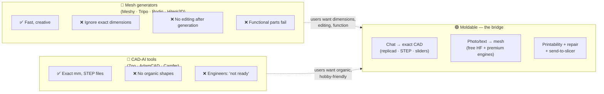
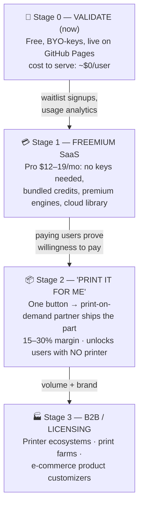
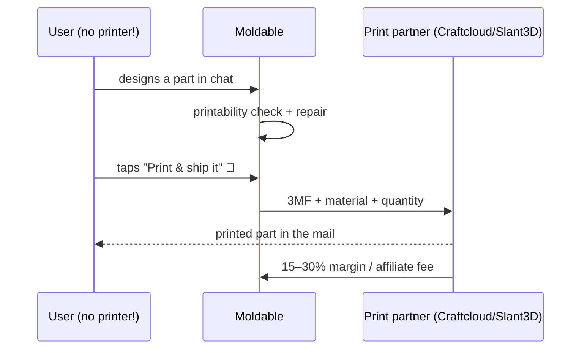
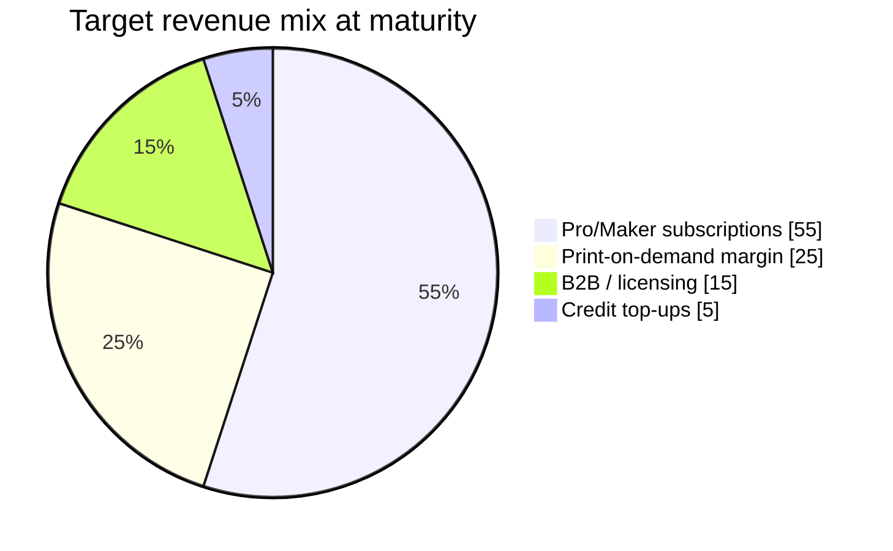

# 💰 Moldable — Commercialization Plan

_Last updated: 2026-07-02 · grounded in the market research in [`RESEARCH.md`](./RESEARCH.md) and the July 2026 competitor/demand audit._

---

## The one-sentence strategy

> **The AI models are commodities. The moat is the workflow — *describe → printable → printed* — so give the workflow away with bring-your-own-keys to grow, and charge for convenience, better engines, and a real object at your door.**

---

## Why Moldable can win

The market is split in half, and nobody serves the bridge:

**Verified unmet demands** (dated Reddit/HN/All3DP evidence, strongest first): post-generation editability · exact dimensions · print-readiness · functional parts · **photo-of-broken-part → replacement** (clearest unshipped workflow in the market — Moldable already ships a v1).

---

## The 4-stage revenue roadmap

### Stage 0 — Validate (where we are)
- Keep the app free and local-first; BYO keys mean **each new user costs ~$0**.
- Add: anonymous usage ping, a "Notify me about Pro" email link, Discord/community.
- ✅ Already done: live site, free HF engine, free Gemini path for CAD mode.
- ⚠️ Naming: `moldable.ai` is taken — run a trademark/domain pass before spending on brand.

### Stage 1 — Freemium SaaS (the core business)

| Tier | Price | What they get | What it costs us |
|---|---|---|---|
| **Free** | $0 | Bring-your-own keys (unlimited) + ~10 bundled mesh credits/mo | ~$0.30–3/user/mo |
| **Pro** | **$12–19/mo** | **Zero setup — no keys**, ~300 mesh credits, premium engines (Rodin), cloud sync/library, priority | ~$3–6/user/mo |
| **Maker+** | $39/mo | Everything + high-res engines, priority GPU, commercial license clarity | ~$10–15/user/mo |

**Unit economics (verified wholesale prices):** a mesh generation costs **$0.03** (TRELLIS via Replicate) to **$0.40** (Rodin via fal); a CAD generation costs **pennies** (LLM tokens). 300 credits inside a $15 plan ≈ **60–80% gross margin**.

**Pricing anchors:** Meshy $20/mo · Tripo ~$20/mo · Spline $12+/mo — and none of them do dimensions or STEP.

**The build:** the existing Cloudflare Worker relay becomes the metering point → add auth (Clerk/Supabase), usage counting, Stripe. The client barely changes.

### Stage 2 — "Print it for me" (the differentiated one)

This monetizes the **outcome**, not the software — and opens the app to the far larger market of people who **don't own a printer**. Verify partner APIs at build time.

### Stage 3 — B2B / licensing
- **Printer ecosystems** (Bambu/Prusa-style app stores want "describe→print" features).
- **E-commerce customizers** ("design your own knob/case" widgets for shops).
- **Print farms** wanting an AI front-door. Licensing the pipeline > running it all ourselves.

---

## Revenue mix target (steady state)

---

## Legal / licensing guardrails (do these before charging)

| Risk | Rule |
|---|---|
| Free HF Spaces in a paid product | ❌ Never — quotas/ToS make them demo-grade. Paid tier = licensed APIs (Tripo/Meshy/fal) or **self-hosted MIT-licensed TRELLIS.2** on serverless GPUs |
| Output licenses | Meshy free tier = CC-BY (attribution) · Tripo free = non-commercial · Hunyuan3D excludes EU/UK/KR + 1M-MAU cap · Stability = $1M revenue cap |
| API keys | Hosted tier keys live **server-side in the relay**, never in the client |
| AI-output copyright | US: substantially-AI works aren't copyrightable — be honest in the license badge ("you own your inputs; outputs are yours to use") |
| Brand | Trademark search + domain before launch (moldable.ai is taken) |

---

## KPIs per stage

| Stage | North star | Guardrail |
|---|---|---|
| 0 Validate | Weekly active designers · % reaching an export | Generation success rate > 80% |
| 1 SaaS | Free→Pro conversion (target 3–5%) | Gross margin > 60% · churn < 5%/mo |
| 2 Print | Print orders per 100 exports | Refund/reprint rate < 5% |
| 3 B2B | Signed integrations | Support load per partner |

---

## What NOT to do

- ❌ Don't paywall the local-first BYO-key app — it's the growth engine and the community goodwill (the market *hates* credit traps; it's their #1 pricing complaint).
- ❌ Don't build a model marketplace early — network effects favor MakerWorld/Printables; integrate with them instead (✅ Open-in-Bambu/Orca already shipped).
- ❌ Don't compete on mesh quality — rent the best engines; own the workflow.
